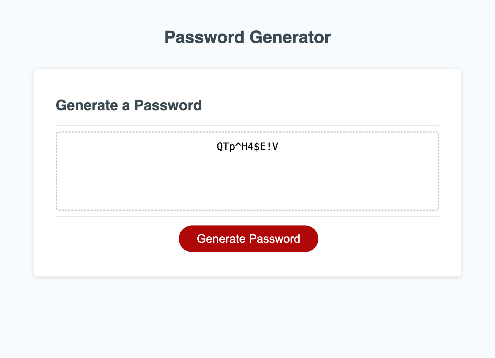

# random-password-generator

## Description
For this challenge we were asked to make a password generator, the generator had to prompt the user to ask how long they would like their password to be and if they wanted uppercase, lowercase, numbers ,and special characters to be included in their password. I personally found this challenge very challenging and had to do a lot of outside research to finish it. One particular challenge for me was to figure out just how to start, it was kind of a guessing game at first, but looking back at the mini project it helped a lot.

## Installation
First thing I did before starting the project was comment out what needed to be done in order, after that I started on creating the variables needed. I knew there needed to be a passwordLength variable because that was the first prompt question. Next thing I did was create uppercase, lowercase, number, and special symbols arrays full of all possible characters the computer could use to generate the password. After I created a new function called prompts where the code would be written to ask the user how long they wanted their password to be, once that was done I knew I needed to make sure the user couldnt use less than 8 characters and no more than 128 characters, also i needed to make sure they only typed in numbers and not words and if they did they would be alerted that they could not do these things and for them to be re prompt with the first question. Next I needed them to confirm if they wanter lowercase, uppercase, numbers and special characters, and if they did i needed it to be added to the password, I got especially stuck here until I realized that I could create and empty array to put this into using the concat method. After that was finsihed I made sure to use the function that was given in the starter code called generatepassword to create a loop and use Math.floor() and Math.random() to generate a random password from what the user chose in the prompts, I got confused here as well i had to keep looking up how to properly do this and look pack on the mini project for help until it worked. lastly I tried to clean up the code the best I could. All in all this was a very challenging first javascript challenge but it was very rewarding when I finally got it to work.

## Usage
This application works by clicking the generate password button, once pushed you will see a mini window appear to ask how many letters you want in your password you may enter any number between 8-128, from there you will be asked what kind of characters you will want to include or not include, once youve filled out all the information you generated password will appear.

link to deployed application: https://heeyitsrissa.github.io/random-password-generator/

screenshot of deployed application: 

## License 

